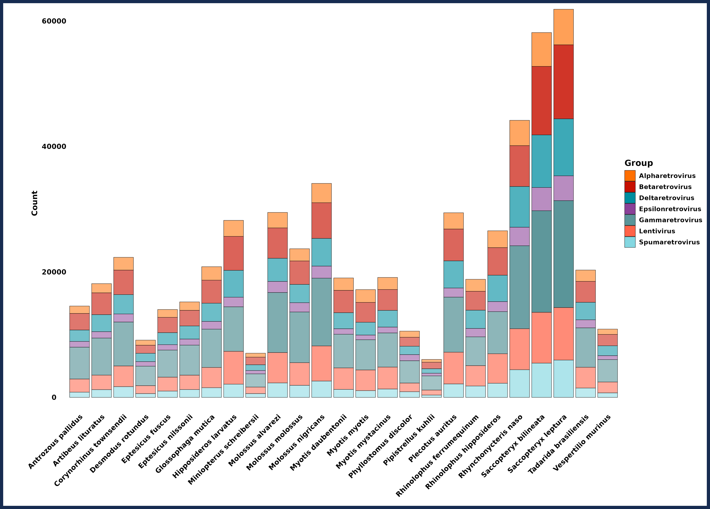
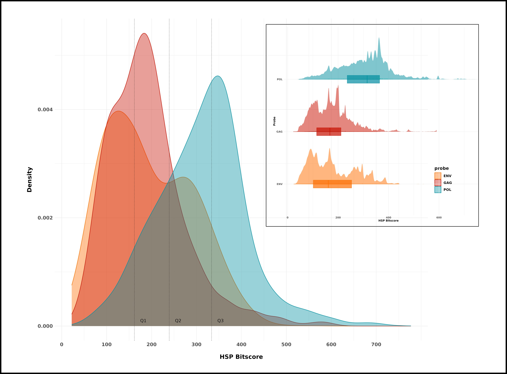
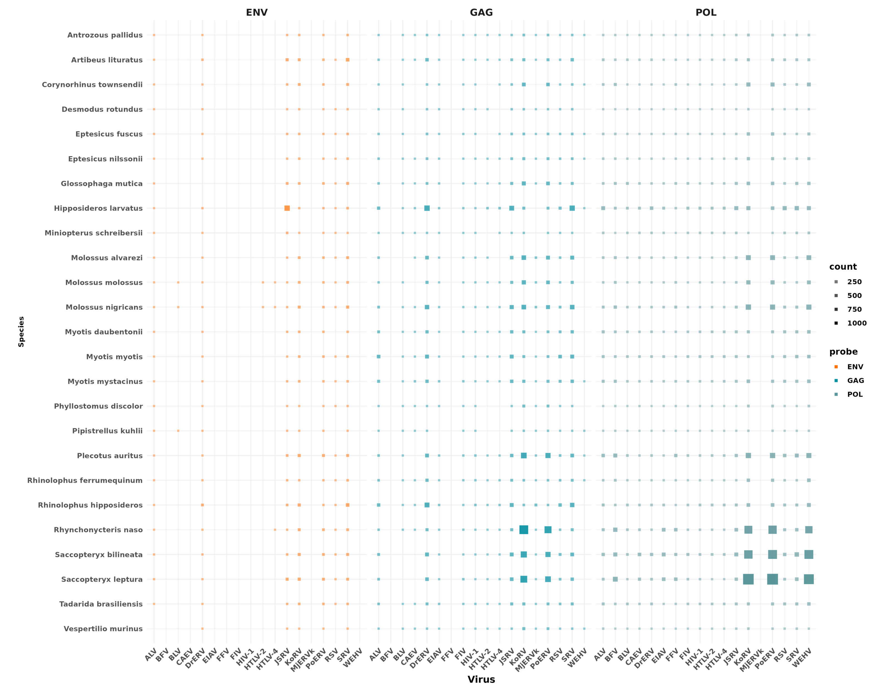
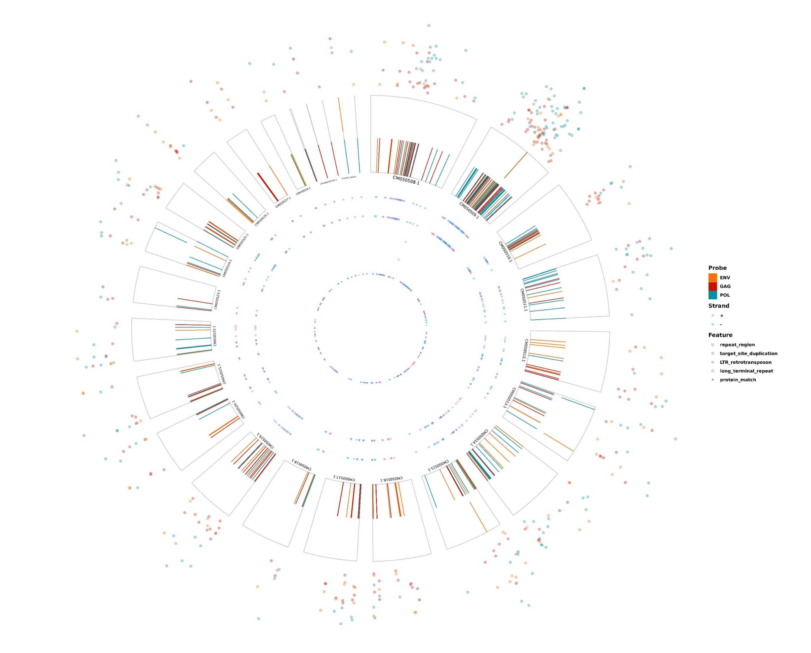

[](https://github.com/JorgeAndOmics?tab=repositories)
[](https://www.linkedin.com/in/jorge-gonzalez-garcia/)


    

# RetroSeek

**RetroSeek** is a full object-oriented, parallelized, end-to-end computational pipeline designed to detect,
categorize and annotate specified ERV integrations in genome assemblies. Built upon the Snakemake
workflow management system, it is designed with a strong emphasis on parallelization, modularity,
resilience, and reproducibility, enabling the efficient and scalable identification of an user-defined set
of proviral sequences across an arbitrarily large number of host genomes in parallel.

**RetroSeek** allows for the automated download, verification, indexing and database generation of the
selected host genomes. Then, it leverages a configurable homology-based search via the **BLAST+**
suite with *de novo* LTR search and HMM domain profiling and analysis via **GenomeTools**. This
integrated strategy enables the identification of high confidence proviral sequence candidates by
reconciling multiple evidence layers, ensuring robust consensus across host genomes.

## Features

- Seamless data acquisition through automated genome downloads, database generation and serialised file handling.

- Highly configurable to support diverse experimental designs. Run arbitrary Snakemake commands on top of your queries.

- End-to-end automation for proviral sequence retrieval and parsing.

- Scalable execution across any environment using Snakemake's dynamic workflow engine.

- Rich, structured logging system to aid in auditing.

- Modular, extensible codebase designed for easy integration, adaptation and reproducibility.

- Intuitive command-line interface optimized for usability.

- Extensive, richly annotated output files in FASTA, GFF3 and tabular formats.

- Integrated, publication-ready reporting with comprehensive visual outputs.


## Installation

To set up and run RetroSeek, follow these steps:

1. **Download RetroSeek**: Obtain the latest version from the [Releases](#) section.

2. **Install Dependencies**: RetroSeek requires the following tools installed on your host system:
   - [BLAST+ (version 2.12 or higher)](https://blast.ncbi.nlm.nih.gov/doc/blast-help/downloadblastdata.html)
   - [Genometools](https://genometools.org/)
   - [NCBI Datasets](https://www.ncbi.nlm.nih.gov/datasets/docs/v2/command-line-tools/download-and-install/)

3. **Create Conda Environment**: After installing the dependencies, set up a new Conda environment using the provided `RetroSeek.yaml` file located in `data/config`:

```bash
conda env create -f data/config/RetroSeek.yaml
```

**Note**: Miniconda is recommended for optimal compatibility. However, you may use Mamba as a faster and more streamlined alternative for managing Conda environments.

4. **Configure RetroSeek**: Edit the `config.yaml` file located in `data/config` to match your specific research requirements and pipeline settings.

5. **Prepare Input Data**: Update the input CSV file (default location: `data/tables`) with the proviral sequences you intend to search against genomic databases. A template file is provided for your convenience. Additionally, if you prefer not to have RetroSeek automatically download genome FASTA files, you can supply your own custom FASTA files. Use the species dictionary within `config.yaml` to map accession codes to descriptive names, as these will appear in output data and visualizations.

6. **Execute RetroSeek**: RetroSeek automatically validates all input files (configuration, input CSV, proviral sequence accessions, FASTA files and dependencies) by default, prompting the user before initiating the pipeline run.


    
## Environment Variables

To enhance performance when downloading data from NCBI, you may optionally provide an NCBI API key. This significantly increases the request rate limit for NCBI services, leading to faster downloads. Instructions for obtaining an API key can be found in the [NCBI documentation](https://support.nlm.nih.gov/kbArticle/?pn=KA-05317).

When launching the pipeline, RetroSeek will prompt you to enter your API key unless input validation is explicitly skipped using `--skip_validation` or `-skp`. The token only needs to be provided once per session. Your API key is sensitive and should not be shared or exposed under any circumstances.

Additionally, it is **mandatory** to provide a valid email address under the `entrez_email` field in your `config.yaml` file. This is required by NCBI’s Entrez API for responsible use and must be present for any remote queries.
## Usage

RetroSeek is executed from the command line, offering fine-grained control over each stage of the pipeline. Navigate to the project root and run:

```bash
./RetroSeek
```

### Command-Line Arguments

- `--download_genomes`: Download genomes as specified in `config.yaml`. Skips already present files in the target directory.
- `--download_hmm`: Retrieve and configure domain HMM databases.
- `--suffix_arrays`: Generate suffix arrays for all genomes using GenomeTools.
- `--ltr_candidates`: Detect LTR candidates via LTRHarvest.
- `--ltr_domains`: Annotate LTR candidates with domain data using LTRDigest.
- `--blast_dbs`: Create BLAST databases from genome FASTA files.
- `--probe_extractor`: Parse the input CSV and extract proviral sequences using NCBI accession IDs.
- `--blast`: Execute tBLASTn searches of input sequences against genome databases.
- `--ranges_analysis`: Integrate BLAST and LTR results into annotated genomic ranges.
- `--generate_global_plots`: Produce analytical plots summarizing key results.
- `--generate_circle_plots`: Generate circular genome visualizations per species.
- `--hotspot_detection`: Identify ERV hotspots within the genomes.
- `--pair_detection`: Identify putative recombination events within the genomes.
- `-skp`, `--skip_validation`: Bypass pre-run input and configuration validation checks.

RetroSeek also supports execution of arbitrary Snakemake workflows to enhance adaptability across environments, including HPC clusters and cloud platforms. For advanced customization, refer to the [Snakemake documentation](https://snakemake.readthedocs.io).

### Example Usage

RetroSeek is designed for resilience and flexibility. In the event of a crash or interruption (e.g., blackout), the pipeline will resume from the most recent successful checkpoint, avoiding the need to reprocess completed steps.

To generate genomic ranges ranked by confidence tiers using all available CPU cores and skip input validation:

```bash
./RetroSeek --ranges_analysis --cores all --skip_validation
```

To generate BLAST databases for specified host genomes, using all cores and suppressing standard progress messages:

```bash
./RetroSeek --blast_dbs --cores all --quiet
```

To extract probe sequences from the input CSV and prepare them for downstream BLAST analysis:

```bash
./RetroSeek --probe_extractor
```

To run only the LTR candidate discovery stage via LTRHarvest, four genomes at a time:

```bash
./RetroSeek --ltr_candidates --cores 4 --keep-going --latency-wait 60
```

To generate genome-wide summary plots from previously computed results:

```bash
./RetroSeek --generate_global_plots --cores 2
```

To generate integrated genomic ranges with a custom Snakemake profile:

```bash
./RetroSeek --ranges_analysis --profile hpc_cluster --latency-wait 90
```

RetroSeek accepts any combination of Snakemake-compatible options to fine-tune performance and scheduling on a wide range of environments, from local development machines to cloud-based and high-performance compute clusters. RetroSeek will generate the optimal Directed Acyclic Graph (DAG) of operations to minimize execution time given the provided resources.

## Screenshots

## Screenshots

[](images/bar.png)

[](images/density.png)

[](images/balloon.png)

[](images/sankey_a.png)

[](images/genome.png)

## Acknowledgements

[](https://postimg.cc/MM9SZwzm)

- *Ní Leathlobhair* lab *@* Moyne

## Contributing

Contributions are always welcome! Feel free to generate a pull request, or contact me at jgonzlez@tcd.ie for any questions!


## License

[MIT](https://choosealicense.com/licenses/mit/)


## References

Camacho, C., Coulouris, G., Avagyan, V., Ma, N., Papadopoulos, J., Bealer, K., & Madden, T. L. (2009). BLAST+: Architecture and applications. *BMC Bioinformatics, 10*, 421. https://doi.org/10.1186/1471-2105-10-421

Gremme, G., Steinbiss, S., & Kurtz, S. (2013). GenomeTools: A comprehensive software library for efficient processing of structured genome annotations. *IEEE/ACM Transactions on Computational Biology and Bioinformatics, 10*(3), 645–656. https://doi.org/10.1109/TCBB.2013.68

Sayers, E. W., Bolton, E. E., Brister, J. R., Canese, K., Chan, J., Comeau, D. C., ... & Ostell, J. (2022). Database resources of the National Center for Biotechnology Information. *Nucleic Acids Research, 50*(D1), D20–D26. https://doi.org/10.1093/nar/gkab1112  
(*Reference for NCBI Datasets and API services*)

Huber, W., Carey, V. J., Gentleman, R., Anders, S., Carlson, M., Carvalho, B. S., ... & Morgan, M. (2015). Orchestrating high-throughput genomic analysis with Bioconductor. *Nature Methods, 12*(2), 115–121. https://doi.org/10.1038/nmeth.3252
