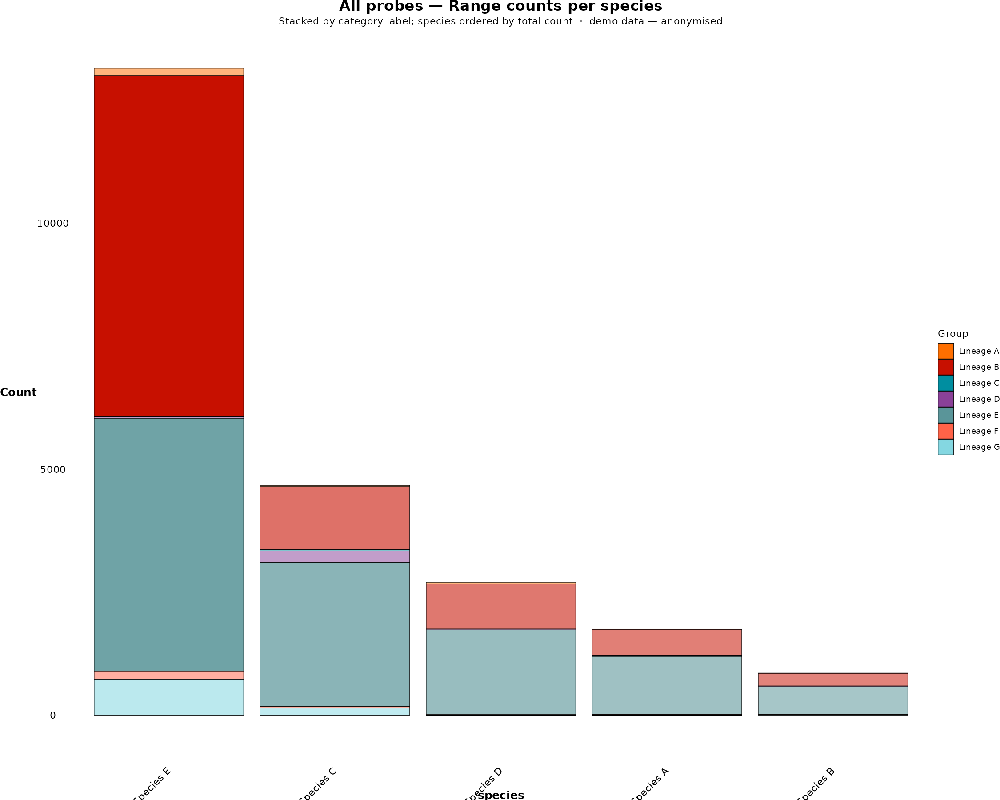
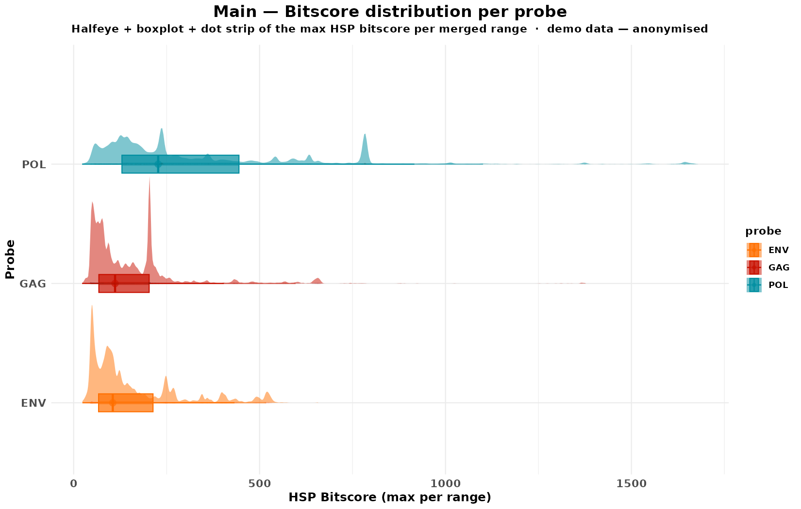
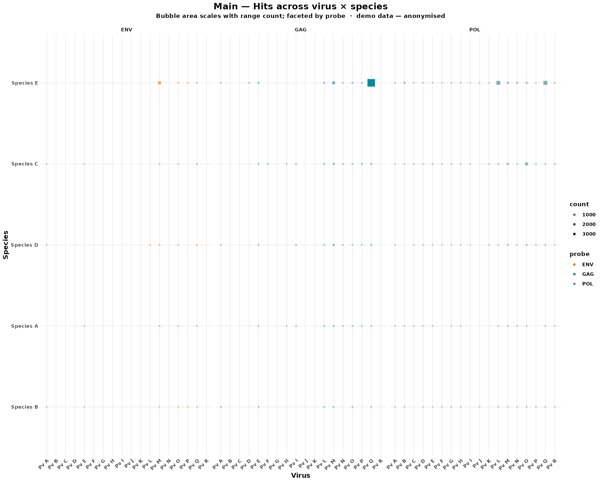
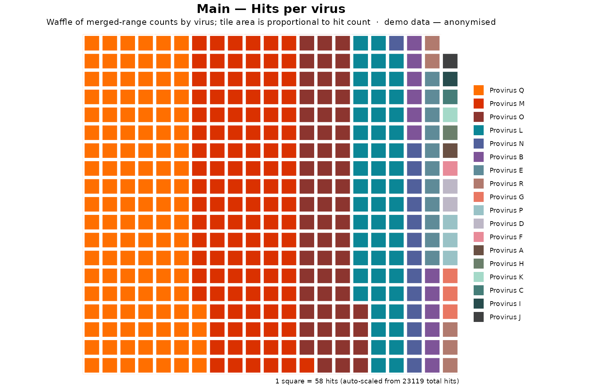
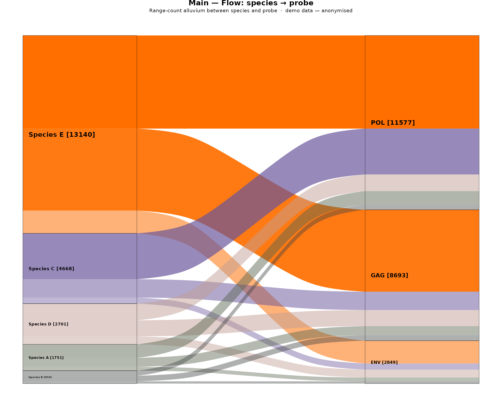
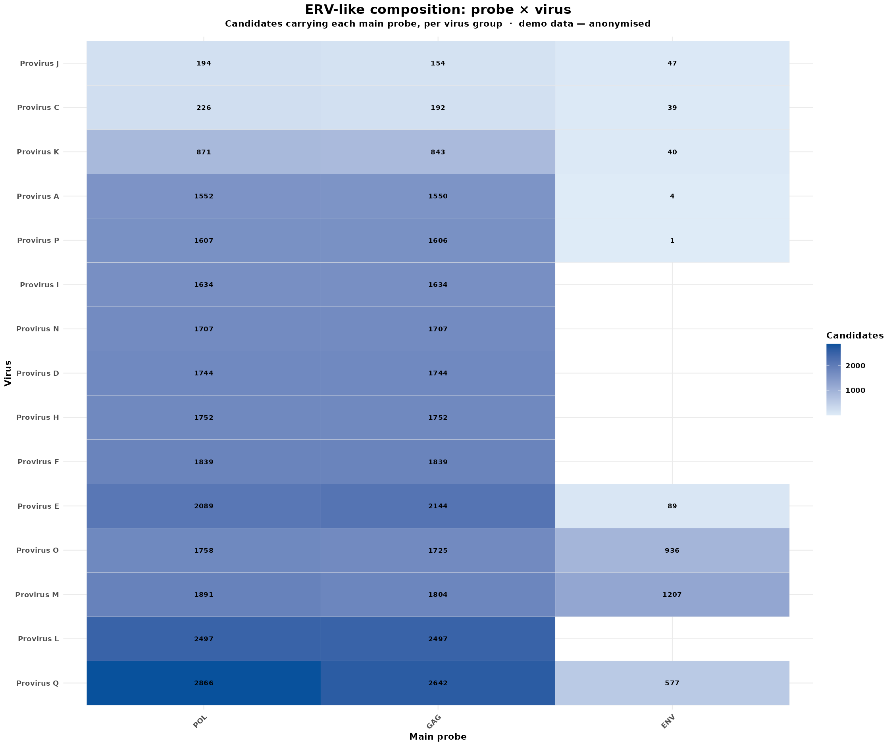

[](https://github.com/JorgeAndOmics?tab=repositories)
[](https://www.linkedin.com/in/jorge-gonzalez-garcia/)


[](https://github.com/JorgeAndOmics/RetroSeek/actions/workflows/ci.yml)


# RetroSeek

**RetroSeek** is an end-to-end Snakemake pipeline that detects, categorises, and annotates endogenous retroviral (ERV) integrations across arbitrarily many host genomes in parallel. It combines configurable homology search (BLAST+), *de novo* LTR discovery with domain profiling (GenomeTools + Pfam), and R-based range analysis, producing publication-ready tracks, tables, and figures.

Built for reproducibility, resilience, and scalable execution on workstations, HPC clusters, and cloud environments.

## Quick start

```bash
# 1. Clone
git clone https://github.com/JorgeAndOmics/RetroSeek.git
cd RetroSeek

# 2. Create and activate the conda/mamba env (single env, all deps)
make env
conda activate retroseek

# 3. Configure
#    The defaults in data/config/config.yaml use repo-relative paths
#    (data/, results/, logs/) so the toy-genome smoke run works out of
#    the box. For production runs pointing at external storage:
cp data/config/config.example.yaml data/config/config.local.yaml
#    Edit data/config/config.local.yaml — set the four `root` paths and
#    `input.probe_csv` to your data, then pass --configfile to RetroSeek.
#    config.local.yaml is gitignored.

# 4. Run any stage via the CLI
./RetroSeek --probe-extractor
./RetroSeek --blast --cores all --configfile data/config/config.local.yaml
./RetroSeek --ranges-analysis --cores all --skip-validation
```

See [`docs/usage.md`](docs/usage.md) for full invocation reference, [`docs/architecture.md`](docs/architecture.md) for the pipeline design, and [`docs/development.md`](docs/development.md) for contributor setup.

## Features

- Automated genome acquisition via NCBI Datasets, with BLAST database and GenomeTools suffix-array generation per genome.
- Configurable homology-based search via BLAST+ and *de novo* LTR discovery via LTRharvest / LTRdigest, reconciled into high-confidence ERV candidate tracks.
- **Solo-LTR detection via LTR_retriever**, pre-filtered to retroviral-only candidates by intersecting LTRharvest output with RetroSeek's `valid_ranges.gff3`. Solo LTRs inherit probe labels from their seed ERVs via a hybrid consensus-family + nearest-ERV fallback, and per-family solo/intact ratios are emitted as a lineage-age proxy. See [`docs/solo_ltr.md`](docs/solo_ltr.md).
- Modular R analysis layer (GenomicRanges / plyranges) producing overlap matrices, hotspot detection (regioneR permutations), and probe-pair tables.
- Configurable metadata aggregation across merged ranges (list / concatenate / best / majority / first / strict) so downstream code can choose lossless vs single-valued columns per field. See [`docs/configuration.md`](docs/configuration.md#aggregation-strategies) and [ADR-002](docs/adr/ADR-002-aggregation-strategies.md).
- Publication-ready plots: density, raincloud, bar, Sankey, balloon, per-genome Circos-style visualisations.
- Structured, colour-coded logging for audit; heartbeat log lines for long-running silent tools (suffixerator, ltrharvest) so progress is observable on multi-hour mammalian runs.
- Single-environment reproducibility (`data/config/environment.yml`) covering Python, R, Bioconductor, and all external bio tools.
- Intuitive CLI delegating to Snakemake — resume from checkpoints after interruption, compose with any Snakemake flag.

> **Feature maturity:** `--hotspot-detection` and `--generate-circle-plots` are *experimental* — functional but lightly tested and subject to change.

## Requirements

- **Mamba** (recommended) or **Conda**. No other system deps — the env provides BLAST+, GenomeTools, NCBI Datasets, Python 3.10, R 4.3, Bioconductor, and all libraries.
- A valid **email address for the NCBI Entrez API**, set under `execution.entrez_email` in `config.yaml` (required by NCBI ToS).
- Optional: an [NCBI API key](https://support.nlm.nih.gov/kbArticle/?pn=KA-05317) for faster remote queries.

## CLI

```
./RetroSeek [STAGE_FLAG] [SNAKEMAKE_FLAGS]
```

Stage flags (one per invocation, or chain stages by running again):

| Flag                        | Stage                                                    |
|-----------------------------|----------------------------------------------------------|
| `--download-genomes`        | Download genomes via NCBI Datasets                       |
| `--download-hmm`            | Fetch and verify the Pfam HMM database                   |
| `--blast-dbs`               | Build BLAST nucleotide DBs per genome                    |
| `--suffix-arrays`           | Build GenomeTools suffix arrays per genome               |
| `--ltr-candidates`          | LTRharvest candidate discovery                           |
| `--ltr-domains`             | LTRdigest domain annotation                              |
| `--probe-extractor`         | Parse probe CSV and fetch probe sequences via Entrez     |
| `--blast`                   | tBLASTn probes against each genome                       |
| `--ranges-analysis`         | Integrate BLAST + LTR → GFF3 tracks + tables             |
| `--generate-global-plots`   | Density / raincloud / bar / Sankey / balloon plots       |
| `--generate-circle-plots`   | Per-genome Circos-style plots                            |
| `--hotspot-detection`       | Permutation-based hotspot analysis                       |
| `--pair-detection`          | Probe-pair (e.g. GAG–ENV) detection per species          |
| `--solo-ltr-detection`      | LTR_retriever over LTRharvest output (retroviral-only pre-filter), solo-LTR probe-label propagation, solo/intact ratio tables |
| `-skp`, `--skip-validation` | Skip pre-run validation (debug use)                      |

Any additional arguments are forwarded to Snakemake (e.g., `--cores`, `--profile`, `--keep-going`, `--latency-wait`).

## Examples

Generate BLAST databases across all available cores:

```bash
./RetroSeek --blast-dbs --cores all
```

LTR candidate discovery, four genomes at a time, resume-friendly:

```bash
./RetroSeek --ltr-candidates --cores 4 --keep-going --latency-wait 60
```

Integrate BLAST + LTR evidence using an HPC profile:

```bash
./RetroSeek --ranges-analysis --profile hpc_cluster --latency-wait 90
```

## Documentation

- [`docs/architecture.md`](docs/architecture.md) — pipeline design, rule graph, data flow.
- [`docs/usage.md`](docs/usage.md) — CLI reference and configuration overview.
- [`docs/configuration.md`](docs/configuration.md) — field-by-field config reference.
- [`docs/solo_ltr.md`](docs/solo_ltr.md) — how LTR_retriever works, how RetroSeek couples to it, and the biology of solo LTRs.
- [`docs/development.md`](docs/development.md) — contributor guide: env, TDD, branch rules, commit style.
- [`docs/adr/`](docs/adr/) — architectural decision records.
- [`CHANGELOG.md`](CHANGELOG.md) — released changes (Keep a Changelog format).

## Showcase

Figures are generated from a representative multi-genome run with **anonymised
demo labels** (`Species A…`, `Provirus A…`, `Lineage A…`) — real organism and
provirus names are replaced, while gene names (POL/GAG/ENV) and the underlying
distributions are kept. Regenerate them with
[`workflow/scripts/demo_figures.R`](workflow/scripts/demo_figures.R).








## Acknowledgements


Developed within the *Ní Leathlobhair* lab at Moyne Institute, Trinity College Dublin.

## Contributing

See [`docs/development.md`](docs/development.md) for workflow, branching, and commit conventions. Pull requests and questions welcome — please open a GitHub issue.

## License

[MIT](LICENSE)

## References

- Camacho, C. *et al.* (2009). BLAST+: Architecture and applications. *BMC Bioinformatics, 10*, 421. https://doi.org/10.1186/1471-2105-10-421
- Gremme, G., Steinbiss, S., & Kurtz, S. (2013). GenomeTools: A comprehensive software library for efficient processing of structured genome annotations. *IEEE/ACM TCBB, 10*(3), 645–656. https://doi.org/10.1109/TCBB.2013.68
- Sayers, E. W. *et al.* (2022). Database resources of the NCBI. *Nucleic Acids Research, 50*(D1), D20–D26. https://doi.org/10.1093/nar/gkab1112
- Huber, W. *et al.* (2015). Orchestrating high-throughput genomic analysis with Bioconductor. *Nature Methods, 12*(2), 115–121. https://doi.org/10.1038/nmeth.3252
- Mölder, F. *et al.* (2021). Sustainable data analysis with Snakemake. *F1000Research, 10*, 33. https://doi.org/10.12688/f1000research.29032.2
